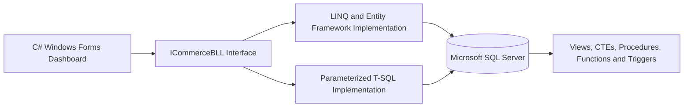
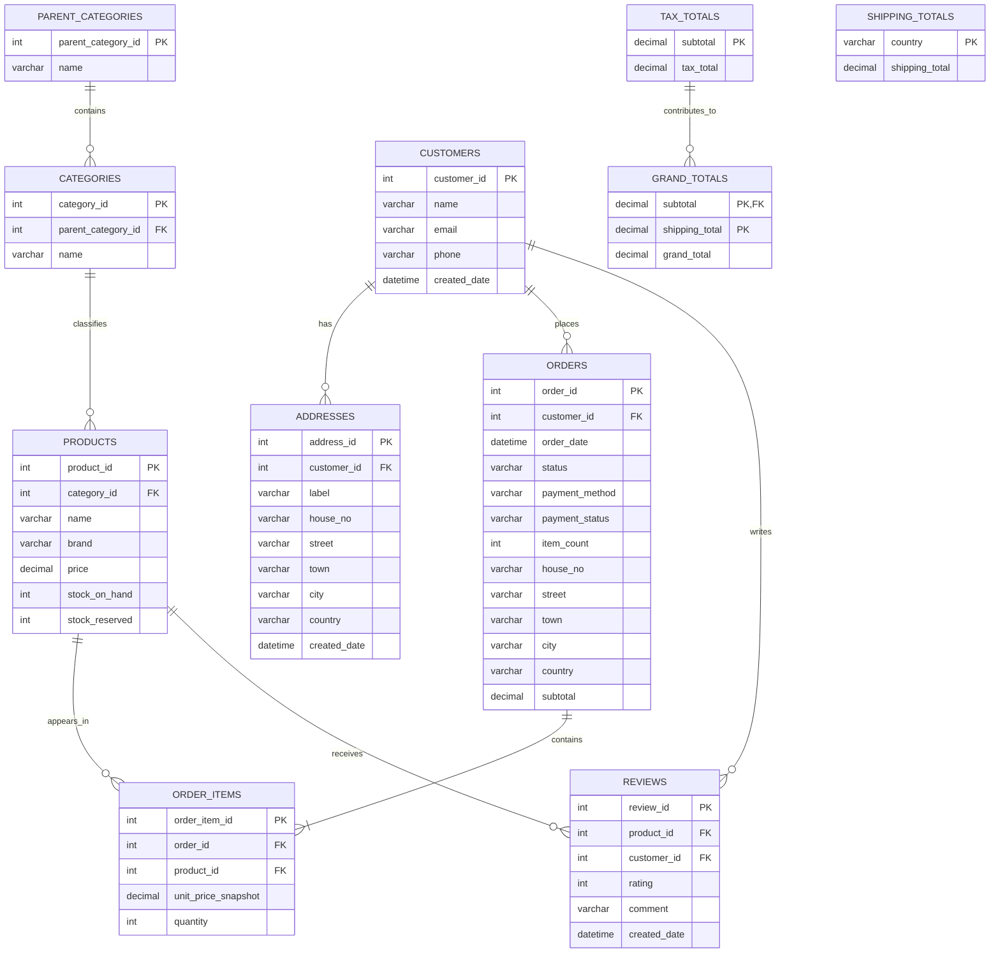

# SQL Server–backed retail management and analytics system


**Retail E-Commerce Core** is a database-backed desktop application for managing and analysing the essential operations of an online retail business. It combines a normalized **Microsoft SQL Server** database with a **C# Windows Forms** dashboard and supports catalogue browsing, inventory tracking, order monitoring, invoice calculations, customer analytics, and product-performance reporting.

The project was developed as an academic database systems project, with emphasis on relational modelling, data integrity, transaction-safe business rules, advanced SQL features, performance optimisation, and application-level database integration.

---

## Table of Contents

- [Project Goals](#project-goals)
- [Key Features](#key-features)
- [System Architecture](#system-architecture)
- [Database Design](#database-design)
- [SQL Features](#sql-features)
- [Application Dashboard](#application-dashboard)
- [Technology Stack](#technology-stack)
- [Project Structure](#project-structure)
- [Getting Started](#getting-started)
- [Using the Application](#using-the-application)
- [Example SQL Commands](#example-sql-commands)
- [Performance and Scalability](#performance-and-scalability)

---

## Project Goals

Small retailers often manage products, stock, customers, delivery details, orders, and reviews in separate files or systems. This can lead to overselling, inconsistent prices, incorrect addresses, slow order processing, and unreliable reports.

Retail E-Commerce Core addresses these problems by providing one structured database that:

- Stores products, categories, customers, addresses, orders, order items, and reviews in a consistent relational model.
- Tracks both stock available in the store and stock reserved for active orders.
- Preserves historical order prices and delivery details even when current product or customer information changes.
- Automates inventory and order-total updates through database triggers.
- Provides reusable views, functions, procedures, and analytical queries for the desktop application.
- Supports large-scale testing through synthetic generation of one million order records.

---

## Key Features

### Product Catalogue

- Organises products using a two-level hierarchy: **Parent Category → Category → Product**.
- Stores product name, brand, price, stock on hand, and reserved stock.
- Supports product browsing and searching by product name or brand.
- Displays category and parent-category information alongside each product.

### Customer and Address Management

- Stores customer contact information in a dedicated table.
- Allows one customer to have multiple labelled addresses, such as Home, Office, or Other.
- Keeps customer and address records separate to avoid duplication.
- Saves an address snapshot inside each order to preserve historical delivery information.

### Order and Inventory Management

- Stores order status, payment method, payment status, item count, delivery details, and subtotal.
- Preserves the price charged at the time of purchase using `unit_price_snapshot` in `ORDER_ITEMS`.
- Automatically reserves stock when an active order item is created.
- Correctly adjusts inventory when order items are updated or removed.
- Releases reserved inventory when an order is shipped.
- Restores inventory when an eligible order is cancelled.
- Converts attempted order deletions into cancellations so order history is retained.

### Pricing and Invoice Calculations

- Calculates line totals using quantity and snapshot price.
- Maintains a fixed 5% tax calculation for the course implementation.
- Looks up shipping charges by country.
- Produces subtotal, tax, shipping, and grand-total summaries for invoices.

### Verified Product Reviews

- Accepts ratings from 1 to 5 with an optional written comment.
- Allows a customer to review a product only after purchasing and receiving it.
- Updates an existing customer review instead of creating duplicate reviews for the same product.
- Combines review information with sales data for product-performance analysis.

### Business Analytics

- Product sales and revenue reports.
- Top customers ranked by delivered-order revenue.
- Top products ranked using sales, revenue, average rating, and review count.
- Pending-order monitoring.
- Order-item and invoice-total lookup by order ID.

---

## System Architecture



The solution separates the user interface from database-access logic:

1. The **Windows Forms application** handles user interaction and presents results in a read-only data grid.
2. The **business-logic interface** defines the operations available to the UI.
3. A **factory** selects between the LINQ/Entity Framework implementation and the SQL-based implementation.
4. **DTOs** transfer query results between the business-logic layer and the application.
5. SQL Server enforces data rules and performs calculations through database objects.

---

## Database Design



### Main Tables

| Table | Purpose |
|---|---|
| `PARENT_CATEGORIES` | Stores top-level catalogue groups. |
| `CATEGORIES` | Stores product categories linked to a parent category. |
| `PRODUCTS` | Stores product information, price, and inventory quantities. |
| `CUSTOMERS` | Stores customer contact details. |
| `ADDRESSES` | Stores multiple labelled addresses for each customer. |
| `ORDERS` | Stores the order lifecycle, payment information, address snapshot, and subtotal. |
| `ORDER_ITEMS` | Stores products, quantities, and historical unit prices for each order. |
| `REVIEWS` | Stores customer ratings and product feedback. |
| `SHIPPING_TOTALS` | Stores country-specific shipping charges. |
| `TAX_TOTALS` | Stores calculated tax values for subtotals. |
| `GRAND_TOTALS` | Stores final totals based on subtotal, tax, and shipping. |

> `ORDERS.country` is used to look up the corresponding shipping charge. The pricing tables are deliberately separated in the course design to reduce repeated calculated values.

---

## SQL Features

### Views

| View | Use Case |
|---|---|
| `ProductCatalogue` | Displays products with category hierarchy, price, brand, and calculated available stock. |
| `PendingOrders` | Lists orders that are still in progress and includes customer and order-total information. |

### Common Table Expressions

| CTE | Use Case |
|---|---|
| `AllCategories` | Lists categories grouped under their parent categories. |
| `ProductSales` | Calculates units sold and revenue for products in delivered orders. |
| `CustomerRevenue` | Identifies the highest-value customers using delivered-order revenue. |

### Stored Procedures

| Procedure | Use Case |
|---|---|
| `usp_GetTopSellingAndTopRatedProducts` | Produces a ranked product report using sales, revenue, ratings, reviews, category, and inventory information. |
| `usp_AddVerifiedReview` | Inserts or updates a review only after confirming that the customer purchased and received the product. |

### Table-Valued Functions

| Function | Use Case |
|---|---|
| `fn_OrderItemsWithLineTotals` | Returns all items in one order and calculates a line total for each item. |
| `fn_OrderTotals` | Returns subtotal, tax, shipping, and grand total for one order. |

### Triggers

| Trigger | Purpose |
|---|---|
| `trg_ORDER_ITEMS_AI_ComputeTotals` | Captures missing snapshot prices and recalculates subtotal, tax, and grand total after item insertion. |
| `trg_ORDER_ITEMS_AI_stock` | Reserves inventory after active order items are inserted. |
| `trg_ORDER_ITEMS_AU_stock` | Reverses old reservations and applies new reservations after item updates. |
| `trg_ORDER_ITEMS_AD_stock` | Releases reserved inventory after item deletion. |
| `trg_ORDERS_AU_stock` | Adjusts inventory when an order becomes shipped or cancelled. |
| `trg_Orders_InsteadOfDelete_Cancel` | Preserves order history by converting deletion attempts into cancellations. |

### Indexes

The database includes non-clustered, unique, filtered, and partition-aligned indexes for common access patterns:

- Reviews by product ID.
- Customer order history by customer ID and descending order date.
- Products by category ID.
- Unique customer lookup by phone number.
- Pending orders by order date.
- Partition-aligned order-date and order-item indexes.

### Partitioning

- `ORDERS` is partitioned by yearly order-date ranges.
- `ORDER_ITEMS` is partitioned by order-ID ranges of 200,000.

These partitions are intended to improve large-table reporting and lookup performance by allowing SQL Server to eliminate irrelevant partitions.

---

## Application Dashboard

The Windows Forms dashboard contains three main tabs.

### Catalog

- Load the complete product catalogue.
- Search products by name or brand.

### Orders

- Load pending orders.
- Enter an order ID to view its items and calculated line totals.
- View subtotal, tax, shipping, and grand total for an order.

### Reports

- Select a starting date for sales analysis.
- Choose the number of results to display.
- View product sales and revenue.
- View top customers by revenue.
- View top-selling and top-rated products.

### Query Mode Selector

The application can switch between:

- **LINQ / Entity Framework mode**
- **SQL-based mode**, which uses parameterized T-SQL queries

Both implementations follow the same `ICommerceBLL` interface, allowing the UI to remain independent of the data-access strategy.

---

## Technology Stack

| Area | Technology |
|---|---|
| Programming Language | C# |
| User Interface | Windows Forms |
| Runtime | .NET Framework 4.7.2 |
| Database | Microsoft SQL Server |
| SQL Language | T-SQL |
| ORM | Entity Framework 6.5.1, Database First |
| Querying | LINQ and parameterized SQL |
| Architecture | UI layer, BLL interface, DTOs, factory pattern, interchangeable implementations |
| Advanced Database Features | Views, CTEs, stored procedures, functions, triggers, indexes, and partitioning |

---

## Project Structure

A clean repository layout for the submitted project is shown below:

```text
Retail-E-Commerce-Core/
├── README.md
├── group18_p2.sql
├── DB_Phase3_Final/
│   ├── DB_Phase3_Final.slnx
│   ├── DB_Phase3_Final/
│   │   ├── Form1.cs
│   │   ├── Form1.Designer.cs
│   │   ├── Program.cs
│   │   ├── App.config
│   │   └── DB_Phase3.csproj
│   ├── DB_Phase3_Final.BLL/
│   │   ├── DTOs/
│   │   ├── Factory/
│   │   ├── Interfaces/
│   │   ├── LINQImpl/
│   │   ├── SPImpl/
│   │   ├── Model1.edmx
│   │   ├── App.Config
│   │   └── DB_Phase3.BLL.csproj
│   └── packages/
└── docs/
    ├── phase-1-proposal.pdf
    ├── phase-2-report.pdf
    └── phase-3-report.pdf
```

Generated folders such as `.vs/`, `bin/`, and `obj/` should normally be excluded from Git using a Visual Studio `.gitignore` file.

---

## Getting Started

### Prerequisites

Install the following before running the project:

- Microsoft SQL Server with SQL authentication or Windows authentication configured.
- SQL Server Management Studio or another SQL Server query tool.
- Visual Studio with the **.NET desktop development** workload.
- .NET Framework 4.7.2 Developer Pack.
- NuGet package restore support.

### 1. Open the Repository

Download or clone the repository, then open the `Retail-E-Commerce-Core` folder.

### 2. Create the Database

Open SQL Server Management Studio and run:

```sql
CREATE DATABASE ECommerce;
GO

USE ECommerce;
GO
```

### 3. Run the Database Script

Open `group18_p2.sql`, make sure the selected database is `ECommerce`, and execute the script.

> **Important:** The script drops existing project tables and generates a large synthetic dataset, including one million orders. Run it in a new or disposable `ECommerce` database, not in a database containing important data. Execution may take several minutes depending on the machine and SQL Server configuration.

For a faster development setup, temporarily reduce the `TOP 1000000` value in the seed section before running the script.

### 4. Configure the Connection String

Update the `ECommerceEntities` connection string in:

```text
DB_Phase3_Final/DB_Phase3_Final/App.config
```

Configure `ECommerceEntities` using the SQL Server instance, authentication method, and database settings available on your machine.

> Never commit real database passwords or other secrets to a public GitHub repository. Use a local configuration file, environment-specific transformation, or secret-management solution for production work.

The class-library configuration can also be kept in sync at:

```text
DB_Phase3_Final/DB_Phase3_Final.BLL/App.Config
```

### 5. Open and Build the Solution

Open:

```text
DB_Phase3_Final/DB_Phase3_Final.slnx
```

Then:

1. Restore NuGet packages.
2. Confirm that `DB_Phase3_Final` is the startup project.
3. Build the solution.
4. Run the application.

If the installed Visual Studio version does not recognise the `.slnx` file, open the two `.csproj` files in a new solution and add the BLL project as a reference to the Windows Forms project.

---

## Using the Application

1. Start the application after configuring the database connection.
2. Use the selector at the top to choose **LINQ / EF** or **SQL-based** mode.
3. Open the **Catalog** tab to browse or search products.
4. Open the **Orders** tab to view pending orders or inspect a specific order.
5. Open the **Reports** tab to generate sales, customer, and product analytics.
6. Results appear in the read-only grid at the bottom of the application.

---

## Example SQL Commands

### View the Product Catalogue

```sql
SELECT *
FROM dbo.ProductCatalogue
ORDER BY product_id;
```

### View Pending Orders

```sql
SELECT *
FROM dbo.PendingOrders
ORDER BY order_date DESC;
```

### Get Top Products

```sql
EXEC dbo.usp_GetTopSellingAndTopRatedProducts
    @since_date = '2025-01-01',
    @top_n = 10,
    @category_id = NULL;
```

### Add or Update a Verified Review

```sql
EXEC dbo.usp_AddVerifiedReview
    @product_id = 1,
    @customer_id = 1,
    @rating = 5,
    @comment = 'Excellent product and delivery experience.';
```

The procedure succeeds only when the customer has a qualifying delivered purchase for the product.

### Get Order Items and Line Totals

```sql
SELECT *
FROM dbo.fn_OrderItemsWithLineTotals(1);
```

### Get Complete Invoice Totals

```sql
SELECT *
FROM dbo.fn_OrderTotals(1);
```

---

## Performance and Scalability

The database script creates a synthetic workload containing approximately:

- 3 parent categories.
- 4 categories.
- 100 products.
- 10,000 customers.
- 1,000,000 orders.
- 1 order-item row for each generated order.

This dataset was used to demonstrate indexing, partitioning, large-table queries, and analytical reporting. The generated records are synthetic and are intended only for testing and coursework demonstration.

---
